||||
|-|-|-|
|[04.02 ⚡ Hands-on Simple Frontend](./course/04.02%20⚡%20Hands-on%20Simple%20Frontend.md)  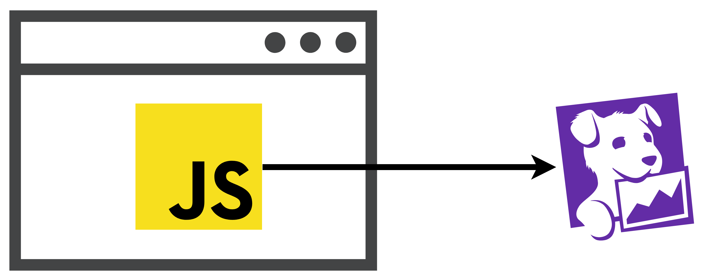|[04.03 ⚡ Hands-on Angular application](./course/04.03%20⚡%20Hands-on%20Angular%20application.md)  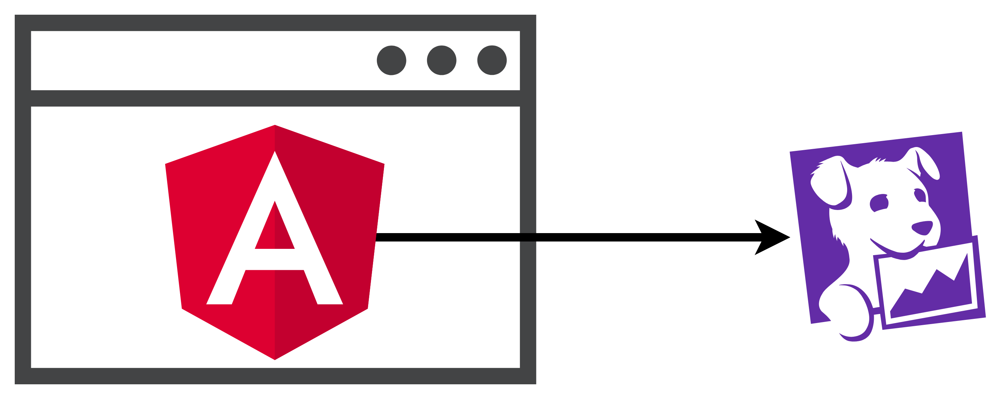|[04.04 ⚡ Hands-on Simple android kotlin](./course/04.04%20⚡%20Hands-on%20Simple%20android%20kotlin.md)  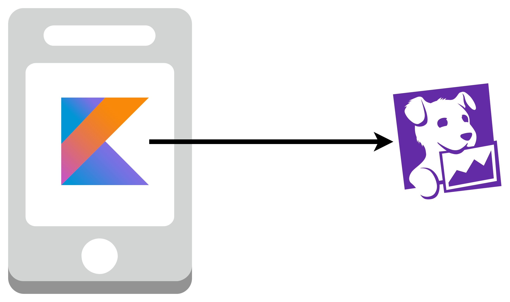|[05.01 ⚡ Hands-on Frontend -_ Lambda -_ DynamoDB](./course/05.01%20⚡%20Hands-on%20Frontend%20-_%20Lambda%20-_%20DynamoDB.md)  |
|[06.03 ⚡ Hands-on Crawler](./course/06.03%20⚡%20Hands-on%20Crawler.md)  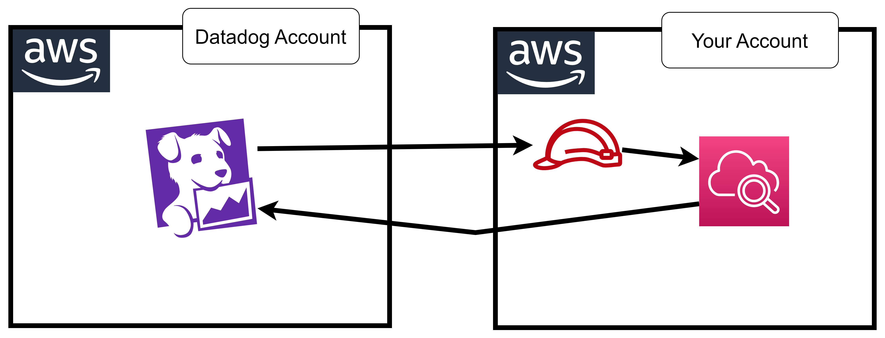|[06.05 ⚡ Hands-on Metric Stream](./course/06.05%20⚡%20Hands-on%20Metric%20Stream.md)  |[06.07 ⚡ Hands-on DD Lambda Forwarder](./course/06.07%20⚡%20Hands-on%20DD%20Lambda%20Forwarder.md)  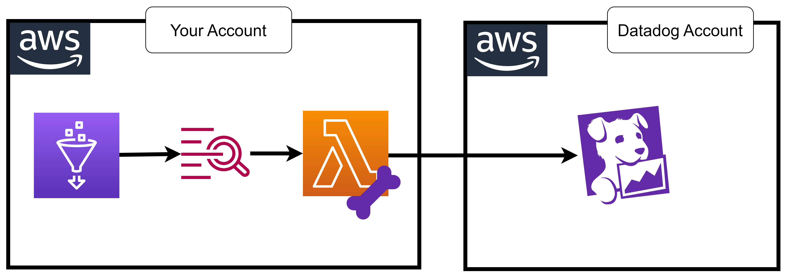|
|[07.02 ⚡ Hands-on Agent Install](./course/07.02%20⚡%20Hands-on%20Agent%20Install.md)  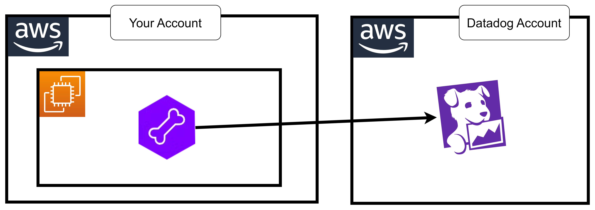|[07.03 ⚡ Hands-on Log Tail](./course/07.03%20⚡%20Hands-on%20Log%20Tail.md)  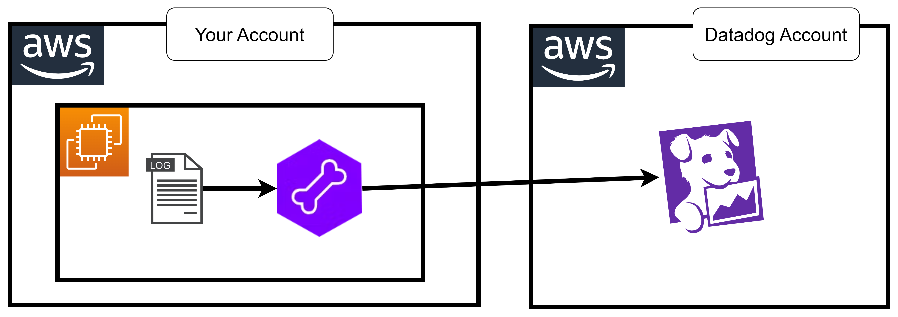|[07.06 ⚡ Hands-on Flask](./course/07.06%20⚡%20Hands-on%20Flask.md)  |
|[07.07 ⚡ Hands-on .NET](./course/07.07%20⚡%20Hands-on%20.NET.md)  |[07.08 ⚡ Hands-on Golang](./course/07.08%20⚡%20Hands-on%20Golang.md)  |[07.10 ⚡ Hands-on Flask Ship Otel using DDOT](./course/07.10%20⚡%20Hands-on%20Flask%20Ship%20Otel%20using%20DDOT.md)  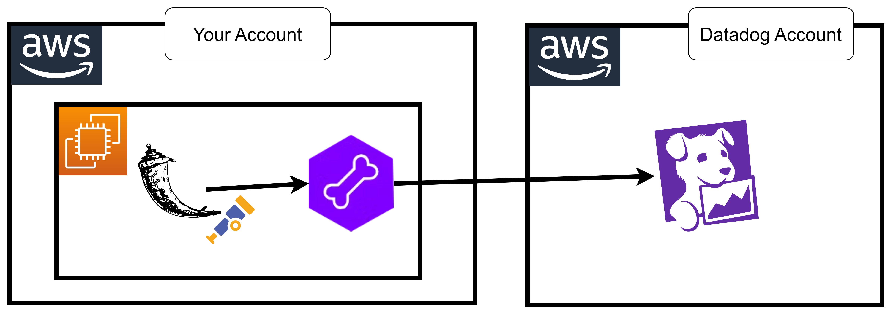|
|[07.12 ⚡ Hands-on Agent Install](./course/07.12%20⚡%20Hands-on%20Agent%20Install.md)  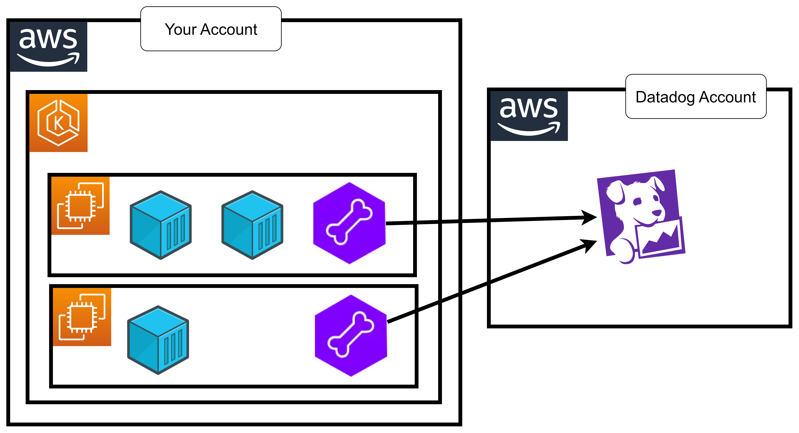|[07.13 ⚡ Hands-on Auto Instrumentation Flask](./course/07.13%20⚡%20Hands-on%20Auto%20Instrumentation%20Flask.md)  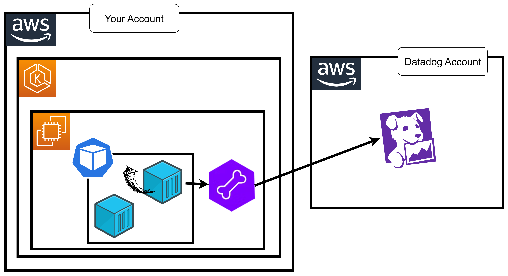|[07.15 ⚡ Hands-on Lambda](./course/07.15%20⚡%20Hands-on%20Lambda.md)  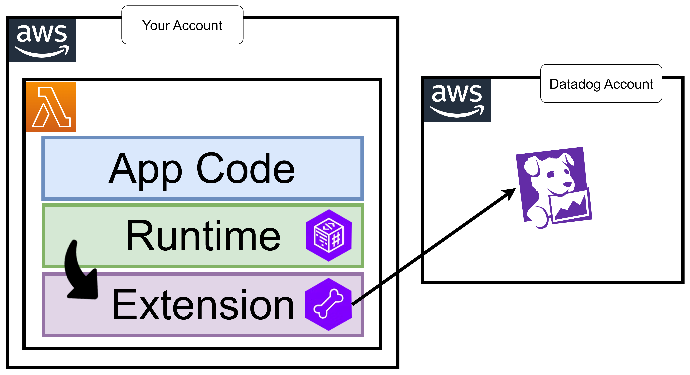|
|[07.16 ⚡ Hands-on Python Send Custom Metrics](./course/07.16%20⚡%20Hands-on%20Python%20Send%20Custom%20Metrics.md)  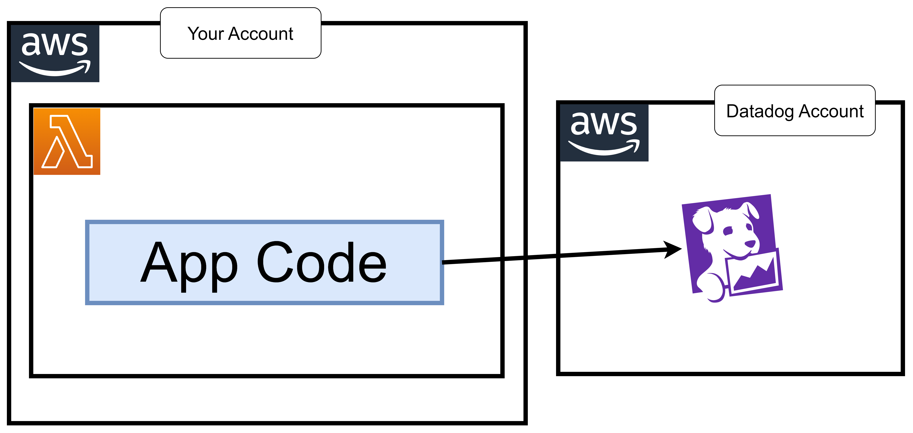|[07.17 ⚡ Hands-on LLM OpenAI](./course/07.17%20⚡%20Hands-on%20LLM%20OpenAI.md)  |[07.19 ⚡ Hands-on RDS](./course/07.19%20⚡%20Hands-on%20RDS.md)  |
|[07.21 ⚡ Hands-on EMR](./course/07.21%20⚡%20Hands-on%20EMR.md)  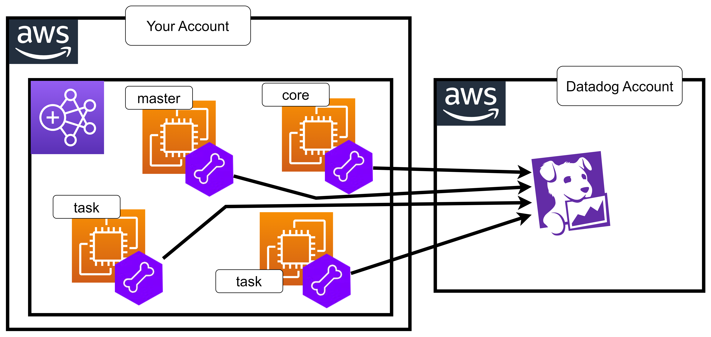|[08.01 ⚡ Hands-on Glue Logs -_ Datadog](./course/08.01%20⚡%20Hands-on%20Glue%20Logs%20-_%20Datadog.md)  |[08.02 ⚡ Hands-on API Gateway Logs](./course/08.02%20⚡%20Hands-on%20API%20Gateway%20Logs.md)  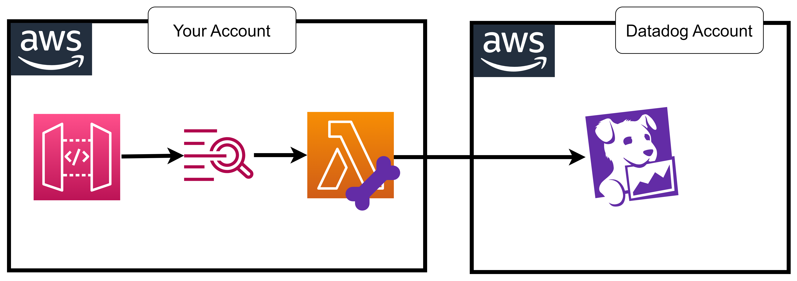|
|[08.03 ⚡ Hands-on Apigw -_ Lambda from AWS X-Ray](./course/08.03%20⚡%20Hands-on%20Apigw%20-_%20Lambda%20from%20AWS%20X-Ray.md)  |[08.04 ⚡ Hands-on Step Function](./course/08.04%20⚡%20Hands-on%20Step%20Function.md)  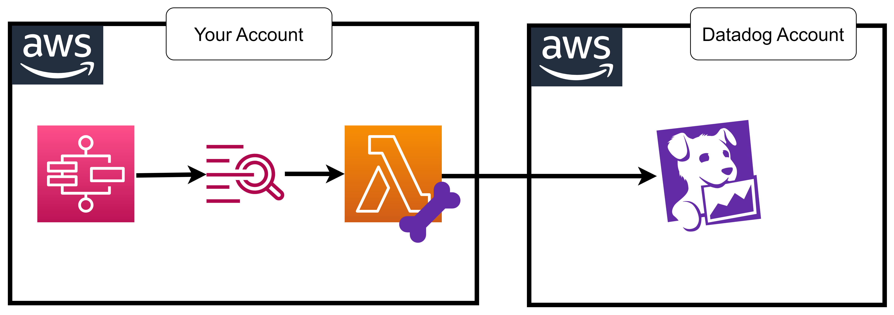|[08.05 ⚡ Hands-on Step Function + Lambda](./course/08.05%20⚡%20Hands-on%20Step%20Function%20+%20Lambda.md)  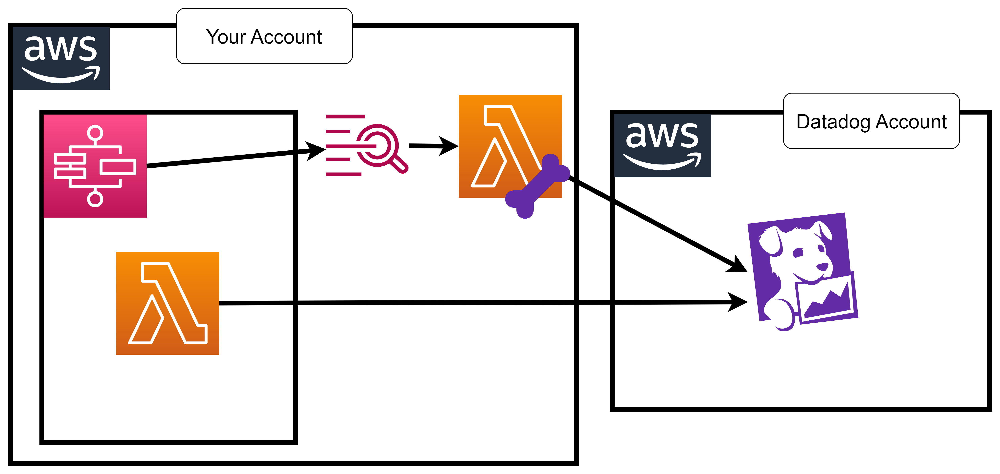|
|[08.06 ⚡ Hands-on DSM Python SQS](./course/08.06%20⚡%20Hands-on%20DSM%20Python%20SQS.md)  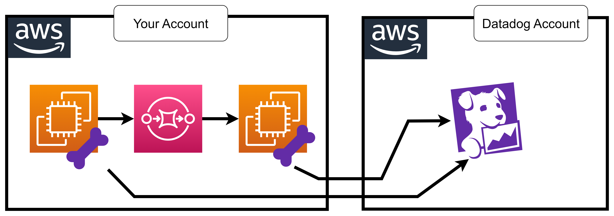|[08.07 ⚡ Hands-on DSM Python Kafka](./course/08.07%20⚡%20Hands-on%20DSM%20Python%20Kafka.md)  |[08.08 ⚡ Hands-on Datadog -_ Log Archive -_ Athena](./course/08.08%20⚡%20Hands-on%20Datadog%20-_%20Log%20Archive%20-_%20Athena.md)  |
|[09.01 ⚡ Hands-on FluentBit Dual Ship -_ Datadog and Cloudwatch](./course/09.01%20⚡%20Hands-on%20FluentBit%20Dual%20Ship%20-_%20Datadog%20and%20Cloudwatch.md)  |[09.02 ⚡ Hands-on FluentBit Triple Ship -_ Datadog, Cloudwatch and S3](./course/09.02%20⚡%20Hands-on%20FluentBit%20Triple%20Ship%20-_%20Datadog,%20Cloudwatch%20and%20S3.md)  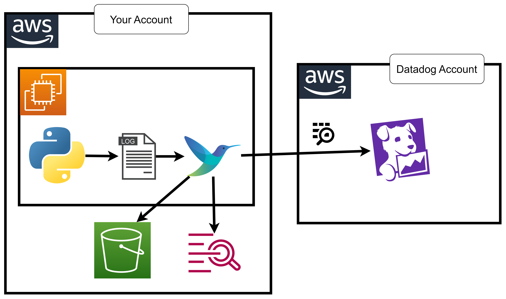|[09.03 ⚡ Hands-on Rsyslog](./course/09.03%20⚡%20Hands-on%20Rsyslog.md)  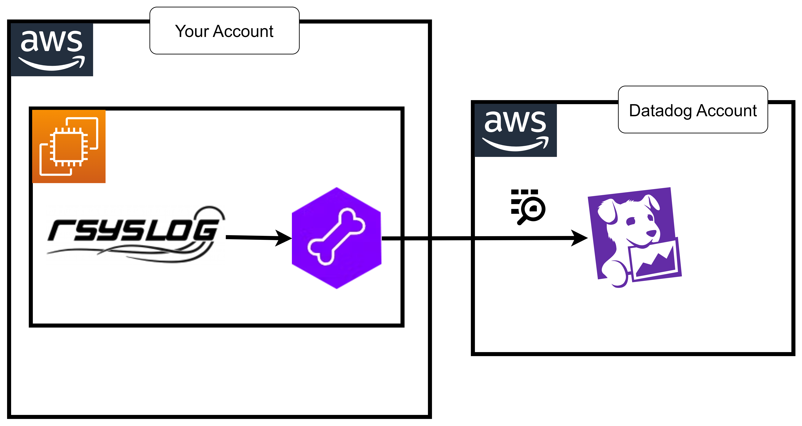|
|[09.04 ⚡ Hands-on REST API](./course/09.04%20⚡%20Hands-on%20REST%20API.md)  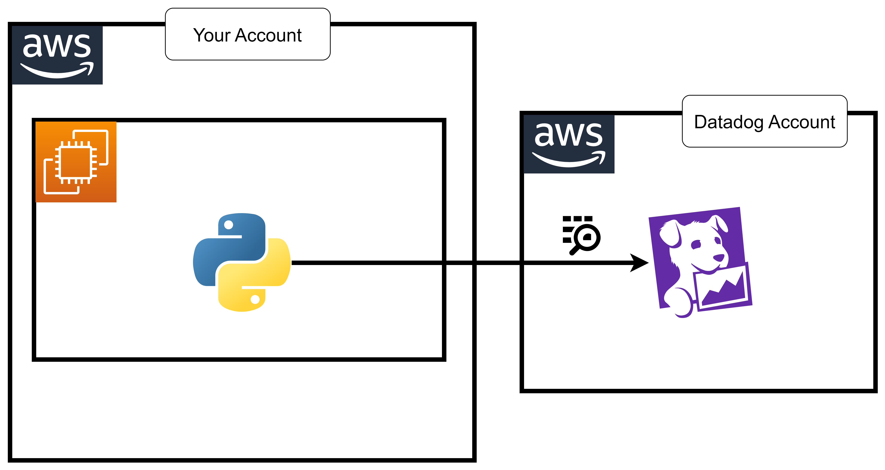|[10.01 ⚡ Hands-on FluentBit lua send custom metrics](./course/10.01%20⚡%20Hands-on%20FluentBit%20lua%20send%20custom%20metrics.md)  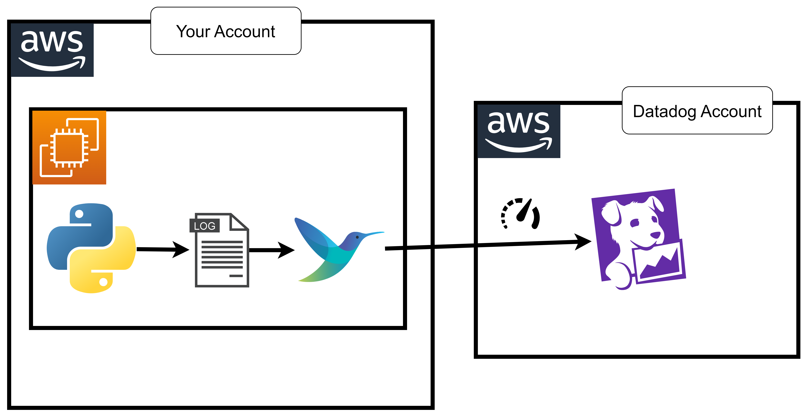|[10.02 ⚡ Hands-on Send custom metrics via Log DD Lambda Forwarder](./course/10.02%20⚡%20Hands-on%20Send%20custom%20metrics%20via%20Log%20DD%20Lambda%20Forwarder.md)  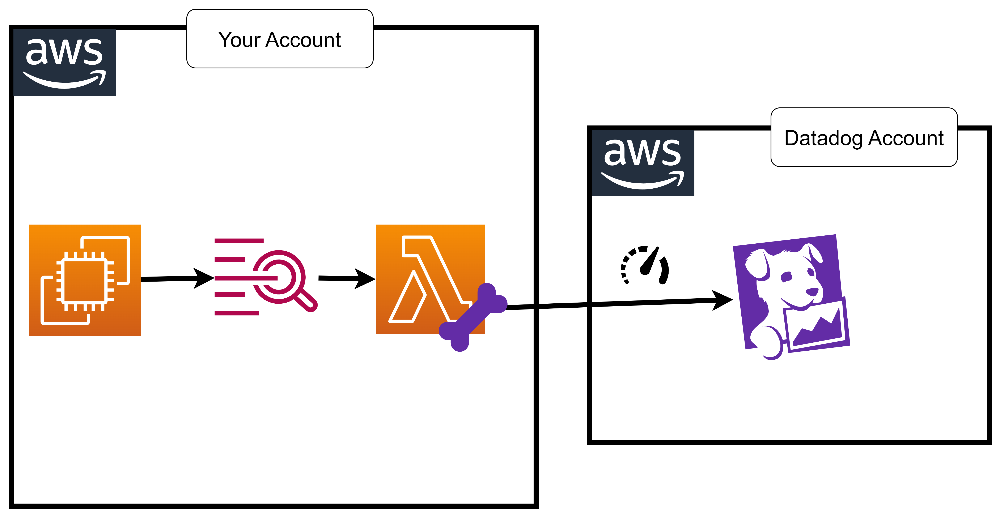|
|[10.03 ⚡ Hands-on REST API](./course/10.03%20⚡%20Hands-on%20REST%20API.md)  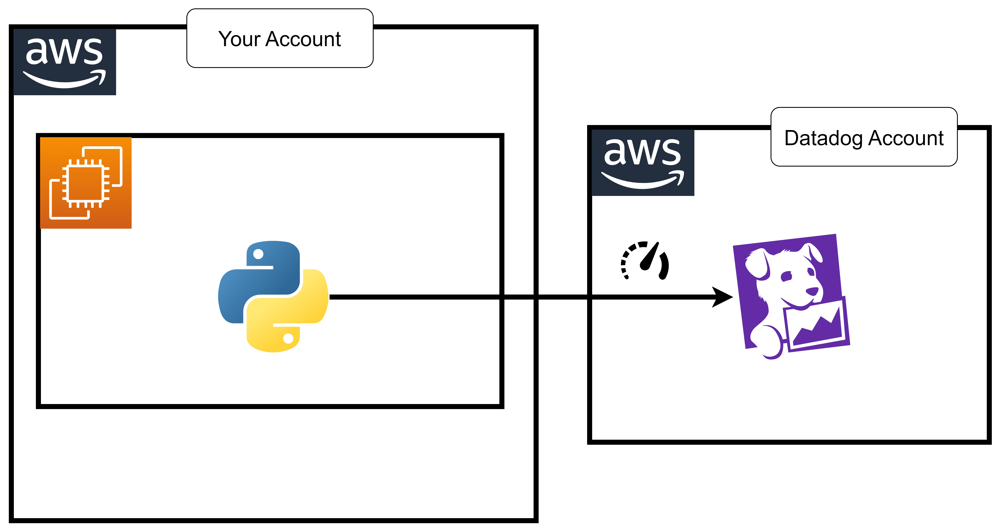|[10.04 ⚡ Hands-on Generate Metrics from Logs inside Datadog](./course/10.04%20⚡%20Hands-on%20Generate%20Metrics%20from%20Logs%20inside%20Datadog.md)  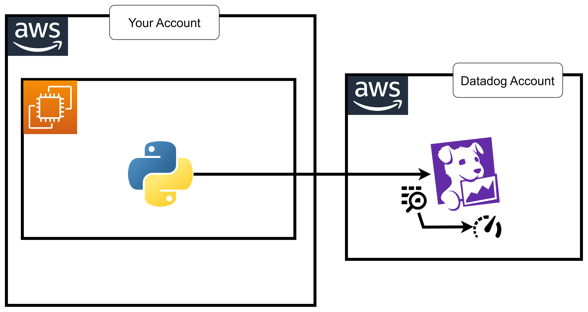|[11.01 ⚡ Hands-on Remediate using Monitors -_ SNS](./course/11.01%20⚡%20Hands-on%20Remediate%20using%20Monitors%20-_%20SNS.md)  |
|[12.01 ⚡ Hands-on Sending a flare from ECS Fargate](./course/12.01%20⚡%20Hands-on%20Sending%20a%20flare%20from%20ECS%20Fargate.md)  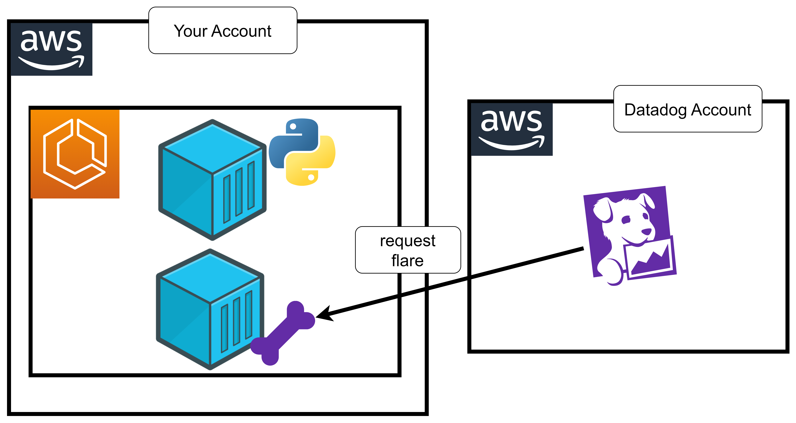|[12.02 ⚡ Hands-on Lag Network](./course/12.02%20⚡%20Hands-on%20Lag%20Network.md)  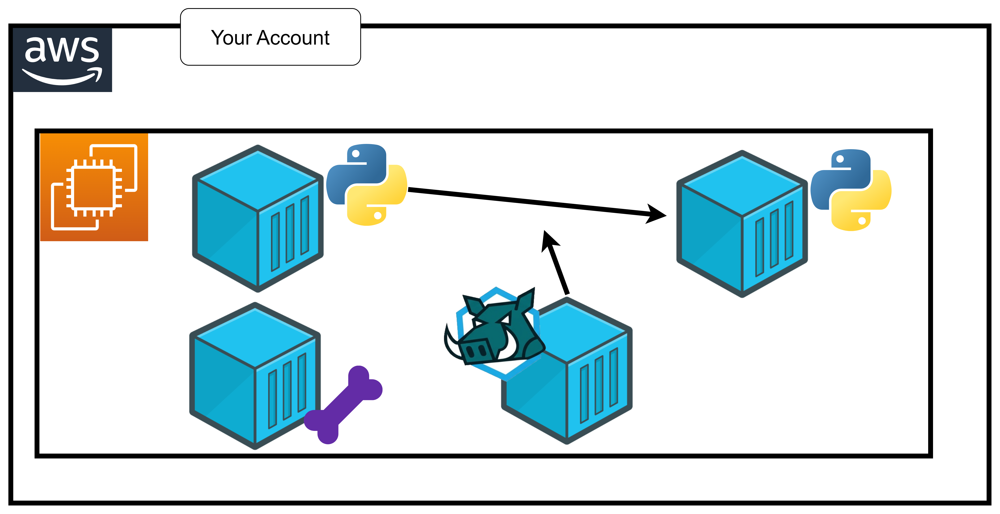|[12.03 ⚡ Hands-on Troubleshoot E2E application](./course/12.03%20⚡%20Hands-on%20Troubleshoot%20E2E%20application.md)  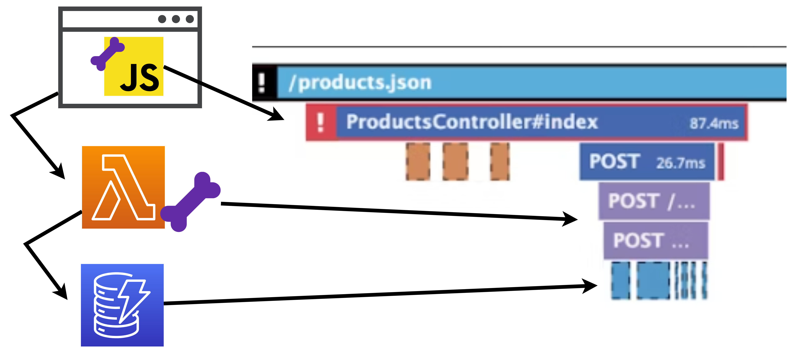|
