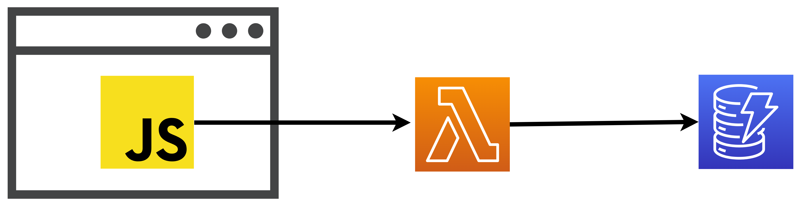

# 14 ⚡ Hands-on Frontend -> Lambda -> DynamoDB



## Frontend code

```html
<html lang="en">
<head>
  <meta charset="UTF-8">
  <meta name="viewport" content="width=device-width, initial-scale=1.0">
  <title>Document</title>
  <style>
    * {
      font-size: 40px;
    }
    textarea {
      font-size:20px;
    }
  </style>
</head>
<body>
  <h3>POST</h3>
  <b>key</b>: <input type="text" style="font-size:30px;" id="postkey"/><br>
  <b>message</b>: <input type="text" style="font-size:30px;" id="postmsg"/><br>
  <button id="postbutton">POST</button>
  <br>
  <textarea id="postrs" style="width:600px;height:300px;"></textarea>      
  <br>
  <h3>GET</h3>
  <b>key</b>: <input type="text" style="font-size:30px;" id="getkey"/>     
  <button id="getbutton">GET</button>
  <br>
  result:<br>
  <textarea id="getrs" style="width:600px;height:300px;"></textarea>       
  <script>
    var postkey = document.querySelector('#postkey')
    var postmsg = document.querySelector('#postmsg')
    var postbutton = document.querySelector('#postbutton')
    var postrs = document.querySelector('#postrs')
    var getbutton = document.querySelector('#getbutton')
    var getkey = document.querySelector('#getkey')
    var gertrs = document.querySelector('#getrs')

    var url = 'myurl'

    postbutton.addEventListener('click', () => {
      postrs.value = 'posting..'
      fetch(url, {
        method: 'POST',
        body: JSON.stringify({
          key: postkey.value,
          msg: postmsg.value,
        })
      }).then(rs => rs.json())
      .then(rs => {
        postrs.value = JSON.stringify(rs, null, 4)
      })
    })
    getbutton.addEventListener('click', () => {
      getrs.value = 'getting..'
      fetch(url+getkey.value).then(rs => rs.json())
      .then(rs => {
        getrs.value = JSON.stringify(rs, null, 4)
      })
    })
  </script>
</body>
</html>
```

## Lambda code

```python
import json
import boto3

def lambda_handler(event, context):
    ddb = boto3.client('dynamodb')
    tablename = 'mytb'
    headers = {
          "Access-Control-Allow-Headers": "Content-Type",
          "Access-Control-Allow-Origin": "*",
          "Access-Control-Allow-Methods": "OPTIONS,POST,GET",
          'Access-Control-Allow-Headers': 'Content-Type,X-Amz-Date,Authorization,X-Api-Key,X-Amz-Security-Token,traceparent,tracestate,x-datadog-origin,x-datadog-parent-id,x-datadog-sampling-priority,x-datadog-trace-id,referer,sec-ch-ua,sec-ch-mobile,sec-ch-ua-platform,user-agent',
      }
    if event['requestContext']['http']['method'] == 'OPTIONS':
        return {
            'statusCode': 200,
            'headers': headers,
        }
    elif event['requestContext']['http']['method'] == 'POST':
        data = json.loads(event['body'])
        rs = ddb.put_item(
            TableName=tablename,
            Item={
                "key": {"S": data['key']},
                "msg": {"S": data['msg']},
            }
        )
        return {
            'statusCode': 200,
            'headers': headers,
            'body': json.dumps(rs)
        }
    else:
        key = event['requestContext']['http']['path'][1:]
        rs = ddb.get_item(
            TableName=tablename,
            Key={"key": {"S": key}}
        )
        return {
            'statusCode': 200,
            'headers': headers,
            'body': json.dumps(rs['Item'])
        }
```


## Instrument Lambda with Datadog

handler

```
datadog_lambda.handler.handler
```

Layer
runtime
```
arn:aws:lambda:us-east-1:464622532012:layer:Datadog-Python313:109
```

extension
```
arn:aws:lambda:us-east-1:464622532012:layer:Datadog-Extension:78
```

Add Tags:
* `DD_API_KEY`: `myapikey`
* `DD_LAMBDA_HANDLER`: `lambda_function.lambda_handler`
* `DD_SERVICE`: `mye2eapp`
* `DD_SITE`: `datadoghq.com`
* `DD_TRACE_ENABLED`: `true`

## Instrument Frontend -> Lambda

allowedTracingUrls
https://docs.datadoghq.com/tracing/other_telemetry/rum/?tab=browserrum#setup-rum

```html
window.DD_RUM.init({
   clientToken: '<CLIENT_TOKEN>',
   applicationId: '<APPLICATION_ID>',
   site: 'datadoghq.com',
   //  service: 'my-web-application',
   //  env: 'production',
   //  version: '1.0.0',
   allowedTracingUrls: [
     "https://api.example.com",
     // Matches any subdomain of my-api-domain.com, such as https://foo.my-api-domain.com
     /^https:\/\/[^\/]+\.my-api-domain\.com/,
     // You can also use a function for advanced matching:
     (url) => url.startsWith("https://api.example.com")
   ],
   sessionSampleRate: 100,
   sessionReplaySampleRate: 100, // if not included, the default is 100
   trackResources: true,
   trackLongTasks: true,
   trackUserInteractions: true,
 })
```


