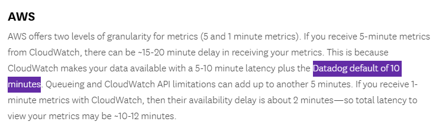

# 17 ⚡ Hands-on Crawler


https://docs.datadoghq.com/integrations/amazon-web-services/

<details>
<summary>policy</summary>

```
{
  "Version": "2012-10-17",
  "Statement": [
    {
      "Action": [
        "account:GetAccountInformation",
        "account:GetContactInformation",
        "airflow:GetEnvironment",
        "airflow:ListEnvironments",
        "amplify:List*",
        "aoss:BatchGetCollection",
        "aoss:ListCollections",
        "apigateway:GET",
        "appstream:Describe*",
        "aps:DescribeRuleGroupsNamespace",
        "aps:DescribeScraper",
        "aps:DescribeWorkspace",
        "aps:ListRuleGroupsNamespaces",
        "aps:ListScrapers",
        "aps:ListWorkspaces",
        "athena:BatchGetNamedQuery",
        "athena:BatchGetPreparedStatement",
        "autoscaling:Describe*",
        "backup:DescribeFramework",
        "backup:GetLegalHold",
        "backup:List*",
        "batch:DescribeJobQueues",
        "batch:DescribeSchedulingPolicies",
        "batch:ListSchedulingPolicies",
        "bcm-data-exports:GetExport",
        "bcm-data-exports:ListExports",
        "bedrock:Get*",
        "bedrock:List*",
        "budgets:ViewBudget",
        "cassandra:Select",
        "cloudformation:DescribeGeneratedTemplate",
        "cloudformation:DescribeResourceScan",
        "cloudformation:ListGeneratedTemplates",
        "cloudformation:ListResourceScans",
        "cloudformation:ListTypes",
        "cloudfront:GetDistributionConfig",
        "cloudfront:ListDistributions",
        "cloudhsm:DescribeBackups",
        "cloudhsm:DescribeClusters",
        "cloudtrail:DescribeTrails",
        "cloudtrail:GetTrail",
        "cloudtrail:GetTrailStatus",
        "cloudtrail:ListTrails",
        "cloudtrail:LookupEvents",
        "cloudwatch:Describe*",
        "cloudwatch:Get*",
        "cloudwatch:List*",
        "codeartifact:DescribeDomain",
        "codeartifact:DescribePackageGroup",
        "codeartifact:DescribeRepository",
        "codeartifact:ListDomains",
        "codeartifact:ListPackageGroups",
        "codeartifact:ListPackages",
        "codedeploy:BatchGet*",
        "codedeploy:List*",
        "codepipeline:GetActionType",
        "codepipeline:ListActionTypes",
        "codepipeline:ListWebhooks",
        "connect:Describe*",
        "connect:List*",
        "controltower:GetLandingZone",
        "controltower:ListEnabledBaselines",
        "controltower:ListEnabledControls",
        "controltower:ListLandingZones",
        "cur:DescribeReportDefinitions",
        "datazone:GetDomain",
        "datazone:ListDomains",
        "deadline:GetBudget",
        "deadline:GetLicenseEndpoint",
        "deadline:GetQueue",
        "deadline:List*",
        "directconnect:Describe*",
        "dlm:GetLifecyclePolicies",
        "dlm:GetLifecyclePolicy",
        "docdb-elastic:GetCluster",
        "docdb-elastic:GetClusterSnapshot",
        "docdb-elastic:ListClusterSnapshots",
        "drs:Describe*",
        "dsql:GetCluster",
        "dsql:ListClusters",
        "dynamodb:Describe*",
        "dynamodb:List*",
        "ec2:Describe*",
        "ec2:Get*",
        "ecs:Describe*",
        "ecs:List*",
        "eks:Describe*",
        "eks:List*",
        "elasticache:Describe*",
        "elasticache:List*",
        "elasticfilesystem:DescribeAccessPoints",
        "elasticfilesystem:DescribeFileSystems",
        "elasticfilesystem:DescribeTags",
        "elasticloadbalancing:Describe*",
        "elasticmapreduce:Describe*",
        "elasticmapreduce:List*",
        "emr-containers:ListManagedEndpoints",
        "emr-containers:ListSecurityConfigurations",
        "emr-containers:ListVirtualClusters",
        "es:DescribeElasticsearchDomains",
        "es:ListDomainNames",
        "es:ListTags",
        "events:CreateEventBus",
        "fsx:DescribeFileSystems",
        "fsx:ListTagsForResource",
        "glacier:GetVaultNotifications",
        "glue:ListRegistries",
        "grafana:DescribeWorkspace",
        "greengrass:Get*",
        "health:DescribeAffectedEntities",
        "health:DescribeEventDetails",
        "health:DescribeEvents",
        "iam:ListAccountAliases",
        "imagebuilder:Get*",
        "imagebuilder:List*",
        "iotsitewise:Describe*",
        "iotsitewise:List*",
        "iottwinmaker:Get*",
        "iottwinmaker:ListComponentTypes",
        "iottwinmaker:ListEntities",
        "iottwinmaker:ListScenes",
        "iotwireless:Get*",
        "iotwireless:List*",
        "ivs:GetChannel",
        "ivs:GetRecordingConfiguration",
        "ivs:List*",
        "ivschat:GetLoggingConfiguration",
        "ivschat:GetRoom",
        "ivschat:ListLoggingConfigurations",
        "ivschat:ListRooms",
        "kinesis:Describe*",
        "kinesis:List*",
        "lambda:GetFunction",
        "lambda:List*",
        "launchwizard:GetDeployment",
        "launchwizard:ListDeployments",
        "lightsail:Get*",
        "logs:DeleteSubscriptionFilter",
        "logs:DescribeLogGroups",
        "logs:DescribeLogStreams",
        "logs:DescribeSubscriptionFilters",
        "logs:FilterLogEvents",
        "logs:PutSubscriptionFilter",
        "logs:TestMetricFilter",
        "macie2:GetAllowList",
        "macie2:GetCustomDataIdentifier",
        "macie2:GetMacieSession",
        "macie2:ListAllowLists",
        "macie2:ListCustomDataIdentifiers",
        "macie2:ListMembers",
        "managedblockchain:Get*",
        "managedblockchain:List*",
        "medialive:List*",
        "memorydb:Describe*",
        "mobiletargeting:Get*",
        "mobiletargeting:ListJourneys",
        "mobiletargeting:ListTemplates",
        "network-firewall:DescribeTLSInspectionConfiguration",
        "network-firewall:DescribeVpcEndpointAssociation",
        "network-firewall:ListTLSInspectionConfigurations",
        "network-firewall:ListVpcEndpointAssociations",
        "networkmanager:Get*",
        "networkmanager:List*",
        "oam:ListAttachedLinks",
        "oam:ListSinks",
        "organizations:Describe*",
        "organizations:List*",
        "osis:GetPipeline",
        "osis:GetPipelineBlueprint",
        "osis:ListPipelineBlueprints",
        "osis:ListPipelines",
        "pca-connector-ad:ListConnectors",
        "pca-connector-ad:ListDirectoryRegistrations",
        "pca-connector-ad:ListTemplates",
        "pca-connector-scep:ListConnectors",
        "personalize:DescribeAlgorithm",
        "personalize:DescribeFeatureTransformation",
        "personalize:DescribeRecipe",
        "personalize:ListRecipes",
        "pipes:ListPipes",
        "proton:Get*",
        "proton:List*",
        "qbusiness:Get*",
        "qbusiness:ListDataAccessors",
        "qldb:ListJournalKinesisStreamsForLedger",
        "ram:GetResourceShareInvitations",
        "rbin:GetRule",
        "rbin:ListRules",
        "rds:Describe*",
        "rds:List*",
        "redshift-serverless:List*",
        "redshift:DescribeClusters",
        "redshift:DescribeLoggingStatus",
        "resiliencehub:DescribeApp",
        "resiliencehub:DescribeAppAssessment",
        "resiliencehub:List*",
        "resource-explorer-2:GetIndex",
        "resource-explorer-2:GetManagedView",
        "resource-explorer-2:GetView",
        "resource-explorer-2:ListManagedViews",
        "resource-explorer-2:ListViews",
        "resource-groups:GetGroup",
        "resource-groups:ListGroups",
        "route53:List*",
        "rum:GetAppMonitor",
        "rum:ListAppMonitors",
        "s3-outposts:ListRegionalBuckets",
        "s3:Get*",
        "s3:ListAllMyBuckets",
        "s3:PutBucketNotification",
        "savingsplans:DescribeSavingsPlanRates",
        "savingsplans:DescribeSavingsPlans",
        "scheduler:GetSchedule",
        "scheduler:ListScheduleGroups",
        "scheduler:ListSchedules",
        "ses:Get*",
        "ses:List*",
        "signer:GetSigningProfile",
        "signer:ListSigningProfiles",
        "sms-voice:Describe*",
        "sns:GetSubscriptionAttributes",
        "sns:List*",
        "sns:Publish",
        "social-messaging:GetLinkedWhatsAppBusinessAccount",
        "social-messaging:ListLinkedWhatsAppBusinessAccounts",
        "sqs:ListQueues",
        "ssm:GetServiceSetting",
        "ssm:ListCommands",
        "states:DescribeStateMachine",
        "states:ListStateMachines",
        "support:DescribeTrustedAdvisor*",
        "support:RefreshTrustedAdvisorCheck",
        "tag:GetResources",
        "tag:GetTagKeys",
        "tag:GetTagValues",
        "timestream:DescribeEndpoints",
        "timestream:ListScheduledQueries",
        "timestream:ListTables",
        "waf-regional:GetRule",
        "waf-regional:GetRuleGroup",
        "waf-regional:ListRuleGroups",
        "waf-regional:ListRules",
        "waf:GetRule",
        "waf:GetRuleGroup",
        "waf:ListRuleGroups",
        "waf:ListRules",
        "wafv2:GetIPSet",
        "wafv2:GetRegexPatternSet",
        "wafv2:GetRuleGroup",
        "wafv2:ListLoggingConfigurations",
        "workmail:DescribeOrganization",
        "workmail:ListOrganizations",
        "xray:BatchGetTraces",
        "xray:GetTraceSummaries"
      ],
      "Effect": "Allow",
      "Resource": "*"
    }
  ]
}
```
</details>

https://docs.datadoghq.com/integrations/guide/cloud-metric-delay/#aws

