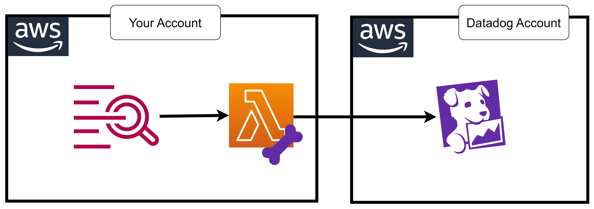

# 21 ⚡ Hands-on DD Lambda Forwarder



## install terraform

https://developer.hashicorp.com/terraform/install

install terraform
```bash
sudo yum install -y yum-utils shadow-utils
sudo yum-config-manager --add-repo https://rpm.releases.hashicorp.com/AmazonLinux/hashicorp.repo
sudo yum -y install terraform
```

## download .zip from releases

https://docs.datadoghq.com/logs/guide/forwarder/?tab=manual

https://github.com/DataDog/datadog-serverless-functions/releases

## terraform to create lambda

```
# main.tf
provider "aws" {
  region = "us-east-1"
}

resource "aws_lambda_function" "dd-lambda-forwarder" {
  function_name = "my-datadog-lambda-forwarder"
  handler      = "lambda_function.lambda_handler"
  runtime      = "python3.12"
  architectures = ["arm64"]
  role         = aws_iam_role.lambda_exec.arn
  memory_size = 512
  timeout = 60

  filename      = "lambda_function.zip"

  environment {
    variables = {
      DD_API_KEY     = "ddapikey"
    }
  }

  source_code_hash = filebase64sha256("lambda_function.zip")
}

resource "aws_iam_role" "lambda_exec" {
  name = "lambda_exec_role"

  assume_role_policy = jsonencode({
    Version = "2012-10-17"
    Statement = [{
      Action = "sts:AssumeRole"
      Effect = "Allow"
      Principal = {
        Service = "lambda.amazonaws.com"
      }
    }]
  })
}

resource "aws_iam_role_policy_attachment" "lambda_basic" {
  role       = aws_iam_role.lambda_exec.name
  policy_arn = "arn:aws:iam::aws:policy/service-role/AWSLambdaBasicExecutionRole"
}
```


