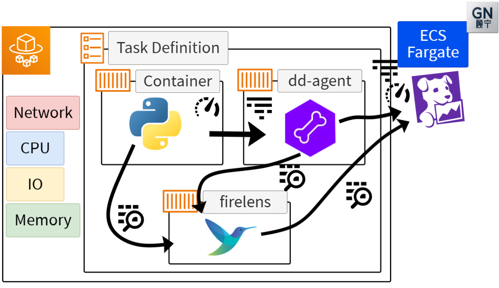

# 26 ⚡ Hands-on Flask


## simple flask application

```python
from flask import Flask
import logging

# Basic configuration
logging.basicConfig(level=logging.INFO)

app = Flask(__name__)

@app.route('/')
def hello_world():
    logging.info("request received") 
    return 'Hello, World!'

if __name__ == '__main__':
    app.run(host='0.0.0.0', port=5000, debug=True)
```

dockerfile

```
FROM public.ecr.aws/docker/library/python:3.12

COPY ./app.py /app.py

RUN pip3 install flask flask-cors

CMD ["python3", "/app.py"]
```

```bash
export accid="654654299310"
export img="myflask"
```

login
```bash
aws ecr get-login-password --region us-east-1 | docker login -u AWS --password-stdin $accid.dkr.ecr.us-east-1.amazonaws.com
```

create ecr
```
aws ecr create-repository --repository-name $img
```

build push
```bash
docker build -t $img .
docker tag $img $accid.dkr.ecr.us-east-1.amazonaws.com/$img:latest
docker push $accid.dkr.ecr.us-east-1.amazonaws.com/$img:latest
```

## add datadog



### app

`pip3 install ddtrace`

`ddtrace-run python3 app.py`

```
# Basic configuration
FORMAT = ('%(asctime)s %(levelname)s [%(name)s] [%(filename)s:%(lineno)d] '
          '[dd.service=%(dd.service)s dd.env=%(dd.env)s dd.version=%(dd.version)s dd.trace_id=%(dd.trace_id)s dd.span_id=%(dd.span_id)s] '
          '- %(message)s')
log = logging.getLogger(__name__)
logging.basicConfig(level=logging.INFO, format=FORMAT)
```

* `DD_SERVICE`: `myflask`
* `DD_ENV`: `dev`
* `DD_VERSION`: `1.0`
* `DD_LOGS_INJECTION`: `true`
* `DD_TAGS`: `source:python,env:dev,service:myflask`

```
{ "name": "DD_SERVICE", "value": "myflask" },
{ "name": "DD_ENV", "value": "dev" },
{ "name": "DD_VERSION", "value": "1.0" },
{ "name": "DD_LOGS_INJECTION", "value": "true" },
{ "name": "DD_TAGS", "value": "source:python,env:dev,service:myflask" }
```

### datadog-agent

https://docs.datadoghq.com/integrations/aws-fargate/?tab=webui

* image: `public.ecr.aws/datadog/agent:latest`
* envs
  * `DD_API_KEY`
  * `ECS_FARGATE`: `true`
  * `DD_APM_ENABLED`: `true`
  * `DD_SITE`: `datadoghq.com`
  * `DD_TAGS`: `env:dev service:myflask`
  
```
{ "name": "DD_API_KEY", "value": "myapikey" },
{ "name": "ECS_FARGATE", "value": "true" },
{ "name": "DD_APM_ENABLED", "value": "true" },
{ "name": "DD_SITE", "value": "datadoghq.com" },
{ "name": "DD_TAGS", "value": "env:dev service:myflask" }
```

### add log firelens

https://docs.datadoghq.com/integrations/aws-fargate/?tab=webui#fluent-bit-and-firelens

```
{
  "logConfiguration": {
    "logDriver": "awsfirelens",
    "options": {
      "Name": "datadog",
      "apikey": "DATADOG_API_KEY",
      "Host": "http-intake.logs.datadoghq.com",
      "dd_service": "myflask",
      "dd_source": "python",
      "dd_message_key": "log",
      "dd_tags": "project:fluentbit,env:dev,service:myflask",
      "TLS": "on",
      "provider": "ecs"
    }
  }
}
```

