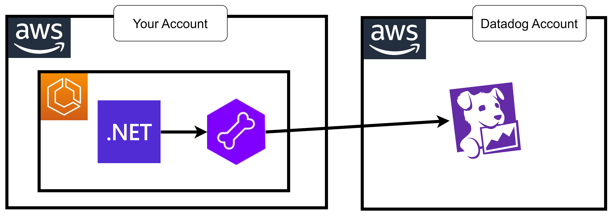

# 27 ⚡ Hands-on .NET



## sample dotnet webapi

dockerfile

```
FROM mcr.microsoft.com/dotnet/aspnet:8.0-alpine

EXPOSE 8080

ENV ASPNETCORE_URLS=http://+:8080
ENV CORECLR_ENABLE_PROFILING=1
ENV CORE_ENABLE_PROFILING=1
ENV CORECLR_PROFILER={846F5F1C-F9AE-4B07-969E-05C26BC060D8}
ENV CORECLR_PROFILER_PATH=/opt/datadog/Datadog.Trace.ClrProfiler.Native.so
ENV DD_DOTNET_TRACER_HOME=/opt/datadog
ENV DD_RUNTIME_METRICS_ENABLED=true

RUN adduser test -D

# Baixa e instala o pacote .deb
RUN mkdir -p /opt/datadog
ADD https://github.com/DataDog/dd-trace-dotnet/releases/download/v3.2.0/datadog-dotnet-apm-3.2.0-musl.tar.gz /tmp/datadog-dotnet-apm-3.2.0-musl.tar.gz
RUN ls -la /opt/datadog
RUN tar -C /opt/datadog -xzf /tmp/datadog-dotnet-apm-3.2.0-musl.tar.gz && sh /opt/datadog/createLogPath.sh
RUN ls -la /opt/datadog
RUN chown -R test /opt/datadog && chmod -R 755 /opt/datadog


RUN apk add dotnet8-sdk
RUN apk add aspnetcore8-runtime
RUN cd /; dotnet new webapi -o api
RUN cd /api; dotnet build

USER test

WORKDIR /api/bin/Debug/net8.0
ENTRYPOINT ["/usr/bin/dotnet", "api.dll"]
```

```bash
export accid="654654299310"
```

login
```bash
aws ecr get-login-password --region us-east-1 | docker login -u AWS --password-stdin $accid.dkr.ecr.us-east-1.amazonaws.com
```

create ecr
```
aws ecr create-repository --repository-name mydotnet
```

build push
```bash
docker build -t mydotnet .
docker tag mydotnet $accid.dkr.ecr.us-east-1.amazonaws.com/mydotnet:latest
docker push $accid.dkr.ecr.us-east-1.amazonaws.com/mydotnet:latest
```

* `DD_SERVICE`: `mydotnet`
* `DD_ENV`: `dev`
* `DD_VERSION`: `1.0`
* `DD_LOGS_INJECTION`: `true`
* `DD_TAGS`: `source:dotnet,env:dev,service:mydotnet`

```
{ "name": "DD_SERVICE", "value": "mydotnet" },
{ "name": "DD_ENV", "value": "dev" },
{ "name": "DD_VERSION", "value": "1.0" },
{ "name": "DD_LOGS_INJECTION", "value": "true" },
{ "name": "DD_TAGS", "value": "source:dotnet,env:dev,service:mydotnet" }
```

### datadog-agent

https://docs.datadoghq.com/integrations/aws-fargate/?tab=webui

* image: `public.ecr.aws/datadog/agent:latest`
* envs
  * `DD_API_KEY`
  * `ECS_FARGATE`: `true`
  * `DD_APM_ENABLED`: `true`
  * `DD_SITE`: `datadoghq.com`
  * `DD_TAGS`: `env:dev service:mydotnet`
  
```
{ "name": "DD_API_KEY", "value": "myapikey" },
{ "name": "ECS_FARGATE", "value": "true" },
{ "name": "DD_APM_ENABLED", "value": "true" },
{ "name": "DD_SITE", "value": "datadoghq.com" },
{ "name": "DD_TAGS", "value": "env:dev service:mydotnet" }
```

### add log firelens

https://docs.datadoghq.com/integrations/aws-fargate/?tab=webui#fluent-bit-and-firelens

```
{
  "logConfiguration": {
    "logDriver": "awsfirelens",
    "options": {
      "Name": "datadog",
      "apikey": "DATADOG_API_KEY",
      "Host": "http-intake.logs.datadoghq.com",
      "dd_service": "mydotnet",
      "dd_source": "dotnet",
      "dd_message_key": "log",
      "dd_tags": "project:fluentbit,env:dev,service:mydotnet",
      "TLS": "on",
      "provider": "ecs"
    }
  }
}
```

