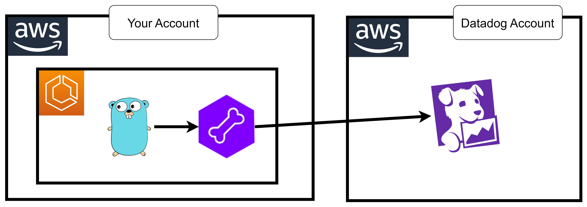

# 28 ⚡ Hands-on Golang



## app code

https://docs.guance.com/en/integrations/ddtrace-golang/#examples

http server

```go
package main

import (
  "log"
  "net/http"
  "time"

  httptrace "gopkg.in/DataDog/dd-trace-go.v1/contrib/net/http"
  "gopkg.in/DataDog/dd-trace-go.v1/ddtrace/tracer"
  "gopkg.in/DataDog/dd-trace-go.v1/profiler"
)

func main() {
  tracer.Start(
    tracer.WithService("test"),
    tracer.WithEnv("test"),
  )
  defer tracer.Stop()

  err := profiler.Start(
    profiler.WithService("test"),
    profiler.WithEnv("test"),
    profiler.WithProfileTypes(
      profiler.CPUProfile,
      profiler.HeapProfile,
      // The profiles below are disabled by
      // default to keep overhead low, but
      // can be enabled as needed.
      // profiler.BlockProfile,
      // profiler.MutexProfile,
      // profiler.GoroutineProfile,
    ),
  )
  if err != nil {
    log.Fatal(err)
  }
  defer profiler.Stop()

  // Create a traced mux router
  mux := httptrace.NewServeMux()
  // Continue using the router as you normally would.
  mux.HandleFunc("/", func(w http.ResponseWriter, r *http.Request) {
    time.Sleep(time.Second)
    w.Write([]byte("Hello World!"))
  })
  if err := http.ListenAndServe(":18080", mux); err != nil {
    log.Fatal(err)
  }
}
```

dockerfile

```
FROM public.ecr.aws/docker/library/golang:latest

COPY ./main.go /go/main.go

RUN go mod init http-server
RUN go get .
RUN go build .

CMD ["/go/http-server"]
```


```
export accid="654654299310"
export img="goapp"
```

login
```bash
aws ecr get-login-password --region us-east-1 | docker login -u AWS --password-stdin $accid.dkr.ecr.us-east-1.amazonaws.com
```

create ecr
```
aws ecr create-repository --repository-name $img
```

build push
```bash
docker build -t $img .
docker tag $img $accid.dkr.ecr.us-east-1.amazonaws.com/$img:latest
docker push $accid.dkr.ecr.us-east-1.amazonaws.com/$img:latest
```


## dd-agent

* image: `public.ecr.aws/datadog/agent:latest`
* envs
  * `DD_API_KEY`
  * `ECS_FARGATE`: `true`
  * `DD_APM_ENABLED`: `true`
  * `DD_SITE`: `datadoghq.com`
  * `DD_TAGS`: `env:dev service:goapp`
  
```
{ "name": "DD_API_KEY", "value": "myapikey" },
{ "name": "ECS_FARGATE", "value": "true" },
{ "name": "DD_APM_ENABLED", "value": "true" },
{ "name": "DD_SITE", "value": "datadoghq.com" },
{ "name": "DD_TAGS", "value": "env:dev service:goapp" }
```