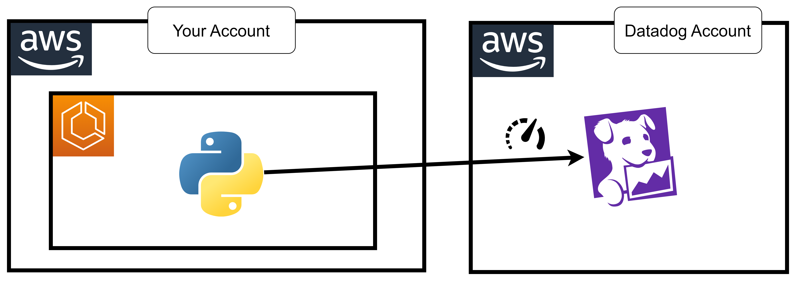

## app container

dogstatsd client 

https://docs.datadoghq.com/developers/dogstatsd/?tab=containeragent#install-the-dogstatsd-client

```bash
pip3 install datadog
```

flask application

```python
from datadog import initialize, statsd
import time
import random
from flask import Flask

options = {
    'statsd_host':'127.0.0.1',
    'statsd_port':8125
}

initialize(**options)

app = Flask(__name__)

@app.route('/')
def hello_world():
    statsd.distribution('guning.custom.distribution', random.randint(0, 20), tags=["env:dev"])
    return 'Hello, World!'

if __name__ == '__main__':
    app.run(host='0.0.0.0', port=5000, debug=True)
```

dockerfile

```dockerfile
FROM public.ecr.aws/docker/library/python:3.12

COPY ./app.py /app.py

RUN pip3 install flask flask-cors datadog

CMD ["python3", "/app.py"]
```

```
export accid="654654299310"
```

login
```bash
aws ecr get-login-password --region us-east-1 | docker login -u AWS --password-stdin $accid.dkr.ecr.us-east-1.amazonaws.com
```

create ecr
```
aws ecr create-repository --repository-name myflaskcustommetric
```

build push
```bash
docker build -t myflaskcustommetric .
docker tag myflaskcustommetric $accid.dkr.ecr.us-east-1.amazonaws.com/myflaskcustommetric:latest
docker push $accid.dkr.ecr.us-east-1.amazonaws.com/myflaskcustommetric:latest
```

## datadog-agent

https://docs.datadoghq.com/integrations/aws-fargate/?tab=webui
https://docs.datadoghq.com/developers/dogstatsd/?tab=containeragent#datadog-agent-dogstatsd-server

* image: `public.ecr.aws/datadog/agent:latest`
* envs
  * `DD_API_KEY`
  * `ECS_FARGATE`: `true`
  * `DD_APM_ENABLED`: `true`
  * `DD_SITE`: `datadoghq.com`
  * `DD_TAGS`: `env:dev service:myflask`
  
```
{ "name": "DD_API_KEY", "value": "myapikey" },
{ "name": "ECS_FARGATE", "value": "true" },
{ "name": "DD_SITE", "value": "datadoghq.com" },
{ "name": "DD_TAGS", "value": "env:dev service:myflaskcustommetric" }


