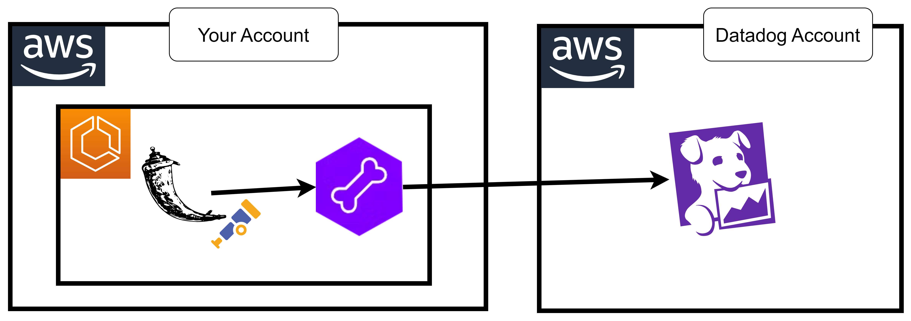
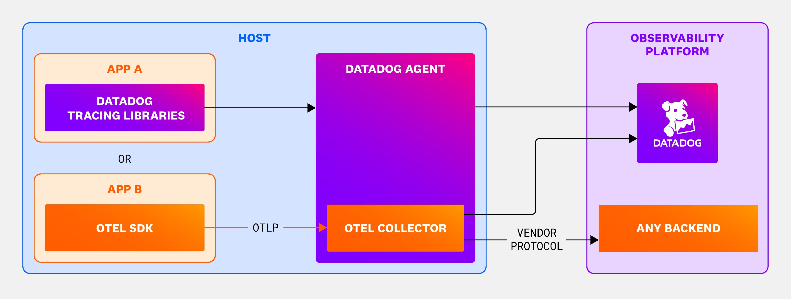

# 30 ⚡ Hands-on Flask Ship Otel using DDOT



https://docs.datadoghq.com/opentelemetry/#option-2-use-the-datadog-agent-with-ddot-collector



## dd-agent

https://docs.datadoghq.com/opentelemetry/setup/otlp_ingest_in_the_agent/?tab=docker

* envs
  * `DD_OTLP_CONFIG_RECEIVER_PROTOCOLS_GRPC_ENDPOINT`: `0.0.0.0:4317`
  * `DD_OTLP_CONFIG_RECEIVER_PROTOCOLS_HTTP_ENDPOINT`: `0.0.0.0:4318`

* image: `public.ecr.aws/datadog/agent:latest`
* envs
  * `DD_API_KEY`
  * `ECS_FARGATE`: `true`
  * `DD_APM_ENABLED`: `true`
  * `DD_SITE`: `datadoghq.com`
  * `DD_TAGS`: `env:dev service:myflask`
  
```
{ "name": "DD_API_KEY", "value": "myapikey" },
{ "name": "ECS_FARGATE", "value": "true" },
{ "name": "DD_APM_ENABLED", "value": "true" },
{ "name": "DD_SITE", "value": "datadoghq.com" },
{ "name": "DD_TAGS", "value": "env:dev service:myflask" },
{ "name": "DD_OTLP_CONFIG_RECEIVER_PROTOCOLS_GRPC_ENDPOINT", "value": "0.0.0.0:4317" },
{ "name": "DD_OTLP_CONFIG_RECEIVER_PROTOCOLS_HTTP_ENDPOINT", "value": "0.0.0.0:4318" }
```

## app

```python
from flask import Flask, jsonify, request
from flask_cors import CORS
from opentelemetry import trace, propagators, baggage
from opentelemetry.instrumentation.flask import FlaskInstrumentor
from opentelemetry.exporter.otlp.proto.grpc.trace_exporter import OTLPSpanExporter
from opentelemetry.trace.propagation.tracecontext import TraceContextTextMapPropagator
from opentelemetry.baggage.propagation import W3CBaggagePropagator
from opentelemetry.sdk.resources import Resource, SERVICE_NAME
from opentelemetry.sdk.trace import TracerProvider
from opentelemetry.sdk.trace.export import BatchSpanProcessor,ConsoleSpanExporter
import os
import requests

app = Flask(__name__)
CORS(app)
FlaskInstrumentor().instrument_app(app)
resource = Resource(attributes={
    "env": "dev",
    "service.name": "app1",
    "team": "team",
})

trace.set_tracer_provider(
    TracerProvider(resource=resource)
)

trace.get_tracer_provider().add_span_processor(BatchSpanProcessor(ConsoleSpanExporter()))

trace.get_tracer_provider().add_span_processor(BatchSpanProcessor(
OTLPSpanExporter(endpoint=os.environ.get("LM_OTEL_ENDPOINT"), insecure=True)))

tracer = trace.get_tracer(__name__)

@app.route("/")
def hello():
    return "Hello World!"

if __name__ == "__main__":
   app.run(port=8080, host='0.0.0.0')
```

dockerfile

```
FROM public.ecr.aws/docker/library/python:3.12

COPY ./app.py /app.py

ENV LM_OTEL_ENDPOINT="http://localhost:4317"

RUN pip3 install flask flask-cors
RUN pip3 install opentelemetry-api
RUN pip3 install opentelemetry-sdk
RUN pip3 install opentelemetry-instrumentation-flask
RUN pip3 install opentelemetry-exporter-otlp

CMD ["python3", "/app.py"]
```

