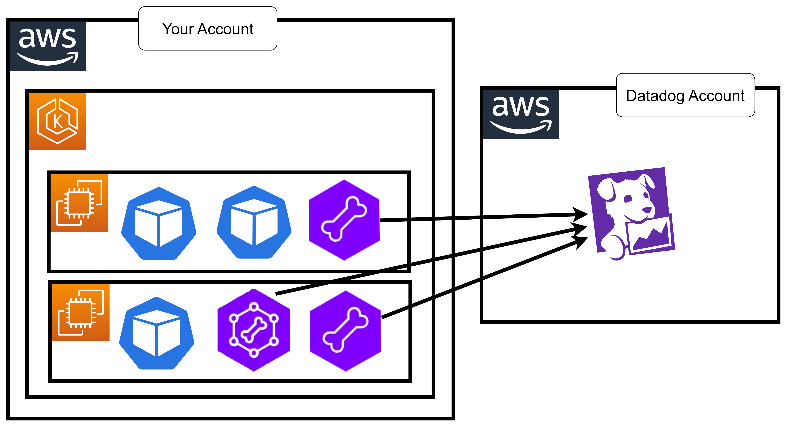

# 32 ⚡ Hands-on Agent and Cluster Agent Install



https://www.datadoghq.com/architecture/efficient-kubernetes-monitoring-with-the-datadog-cluster-agent/


## install kubectl

```bash
curl -O https://s3.us-west-2.amazonaws.com/amazon-eks/1.29.3/2024-04-19/bin/linux/amd64/kubectl
mv kubectl /usr/bin/
chmod +x /usr/bin/kubectl
alias k='kubectl'
```

## install helm

https://helm.sh/docs/intro/install/

```bash
curl -fsSL -o get_helm.sh https://raw.githubusercontent.com/helm/helm/main/scripts/get-helm-3
chmod 700 get_helm.sh
./get_helm.sh
```

## install eksctl

https://docs.aws.amazon.com/eks/latest/userguide/getting-started-eksctl.html
https://eksctl.io/installation/

```bash
# for ARM systems, set ARCH to: `arm64`, `armv6` or `armv7`
ARCH=amd64
PLATFORM=$(uname -s)_$ARCH

curl -sLO "https://github.com/eksctl-io/eksctl/releases/latest/download/eksctl_$PLATFORM.tar.gz"

# (Optional) Verify checksum
curl -sL "https://github.com/eksctl-io/eksctl/releases/latest/download/eksctl_checksums.txt" | grep $PLATFORM | sha256sum --check

tar -xzf eksctl_$PLATFORM.tar.gz -C /tmp && rm -f eksctl_$PLATFORM.tar.gz

sudo mv /tmp/eksctl /usr/local/bin
```

## install k9s

https://github.com/derailed/k9s/releases

`yum -y install https://github.com/derailed/k9s/releases/download/v0.50.9/k9s_linux_amd64.rpm`

## create eks cluster

```bash
eksctl create cluster \
	--name eksdemo1 \
	--region us-east-1 \
	--nodegroup-name my-nodegroup \
	--node-type c5a.xlarge \
	--nodes 3 \
	--nodes-min 2 \
	--nodes-max 5
```

## setup kubeconfig

```bash
aws eks update-kubeconfig --name eksdemo1 --region us-east-1
```

## install datadog-agent

