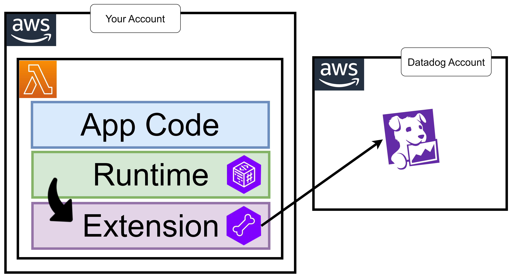

# 35 ⚡ Hands-on Lambda




## Instrument Lambda with Datadog

handler

```
datadog_lambda.handler.handler
```

Layer
runtime
```
arn:aws:lambda:us-east-1:464622532012:layer:Datadog-Python313:109
```

extension
```
arn:aws:lambda:us-east-1:464622532012:layer:Datadog-Extension:78
```

Add Tags:
* `DD_API_KEY`: `myapikey`
* `DD_LAMBDA_HANDLER`: `lambda_function.lambda_handler`
* `DD_SERVICE`: `simplelambda`
* `DD_SITE`: `datadoghq.com`
* `DD_TRACE_ENABLED`: `true`


