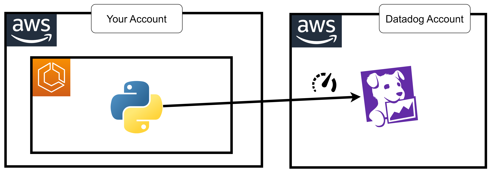

# 36 ⚡ Hands-on Python Send Custom Metrics



https://docs.datadoghq.com/serverless/aws_lambda/metrics/?tab=python#submit-custom-metrics

```python
from datadog_lambda.metric import lambda_metric

def lambda_handler(event, context):
    lambda_metric(
        "coffee_house.order_value",             # Metric name
        12.45,                                  # Metric value
        tags=['product:latte', 'order:online']  # Associated tags
    )
```

layer runtime

```
arn:aws:lambda:us-east-1:464622532012:layer:Datadog-Python313:109
```

Add Tags:
* `DD_API_KEY`: `myapikey`
* `DD_SITE`: `datadoghq.com`
