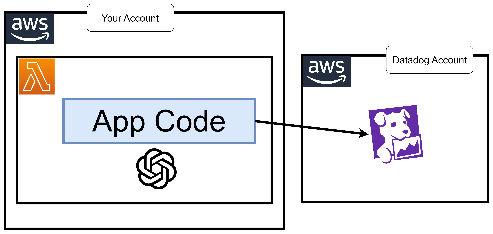

# 37 ⚡ Hands-on LLM OpenAI



lambda code

```python
import os
from openai import OpenAI

def lambda_handler(event, context):
  oai_client = OpenAI(api_key=os.environ.get("OPENAI_API_KEY"))
  
  completion = oai_client.chat.completions.create(
     model="gpt-3.5-turbo",
     messages=[
      {"role": "system", "content": "You are a helpful customer assistant for a furniture store."},
      {"role": "user", "content": "I'd like to buy a chair for my living room."},
  ],
  )
  
  print(completion)
```

## Instrument Lambda with Datadog

handler

```
datadog_lambda.handler.handler
```

Layer
runtime
```
arn:aws:lambda:us-east-1:464622532012:layer:Datadog-Python313:109
```

envs
* `DD_API_KEY`: `ddapikey`
* `OPENAI_API_KEY`: `openaiapikey`
* `DD_LLMOBS_ENABLED`: `1`
* `DD_LLMOBS_ML_APP`: `myopenaiapp`
* `DD_LLMOBS_AGENTLESS_ENABLED`: `1`


