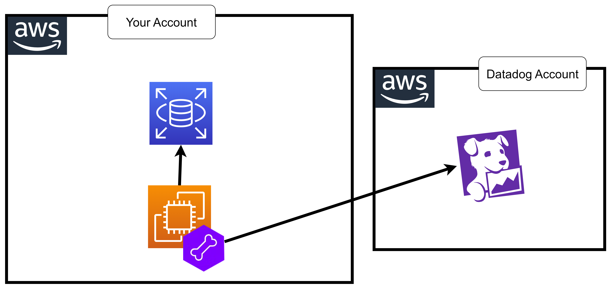

# 39 ⚡ Hands-on RDS



## start RDS postgres17

## install psql

https://stackoverflow.com/questions/49573258/installing-postgresql-client-v10-on-aws-amazon-linux-ec2-ami

`sudo amazon-linux-extras install postgresql10`

## add datadog user

https://docs.datadoghq.com/database_monitoring/setup_postgres/rds/?tab=postgres15

```
CREATE USER datadog WITH password 'datadog';
```

```sql
ALTER ROLE datadog INHERIT;
CREATE SCHEMA datadog;
GRANT USAGE ON SCHEMA datadog TO datadog;
GRANT USAGE ON SCHEMA public TO datadog;
GRANT pg_monitor TO datadog;
CREATE EXTENSION IF NOT EXISTS pg_stat_statements schema public;
```

collect explain plans

```sql
CREATE OR REPLACE FUNCTION datadog.explain_statement(
   l_query TEXT,
   OUT explain JSON
)
RETURNS SETOF JSON AS
$$
DECLARE
curs REFCURSOR;
plan JSON;

BEGIN
   OPEN curs FOR EXECUTE pg_catalog.concat('EXPLAIN (FORMAT JSON) ', l_query);
   FETCH curs INTO plan;
   CLOSE curs;
   RETURN QUERY SELECT plan;
END;
$$
LANGUAGE 'plpgsql'
RETURNS NULL ON NULL INPUT
SECURITY DEFINER;
```

```
export PGPASSWORD=datadog
```

export host="your RDS host"

verify

```sql
psql -h $host -U datadog postgres -A \
  -c "select * from pg_stat_database limit 1;" \
  && echo -e "\e[0;32mPostgres connection - OK\e[0m" \
  || echo -e "\e[0;31mCannot connect to Postgres\e[0m"
psql -h localhost -U datadog postgres -A \
  -c "select * from pg_stat_activity limit 1;" \
  && echo -e "\e[0;32mPostgres pg_stat_activity read OK\e[0m" \
  || echo -e "\e[0;31mCannot read from pg_stat_activity\e[0m"
psql -h localhost -U datadog postgres -A \
  -c "select * from pg_stat_statements limit 1;" \
  && echo -e "\e[0;32mPostgres pg_stat_statements read OK\e[0m" \
  || echo -e "\e[0;31mCannot read from pg_stat_statements\e[0m"
```

## setup datadog-agent

```
init_config:
instances:
  - dbm: true
    host: '<AWS_INSTANCE_ENDPOINT>'
    port: 5432
    username: datadog
    password: 'ENC[datadog_user_database_password]'
    aws:
      instance_endpoint: '<AWS_INSTANCE_ENDPOINT>'
      region: '<REGION>'
    tags:
      - "dbinstanceidentifier:<DB_INSTANCE_NAME>"

    ## Required for Postgres 9.6: Uncomment these lines to use the functions created in the setup
    # pg_stat_statements_view: datadog.pg_stat_statements()
    # pg_stat_activity_view: datadog.pg_stat_activity()

    ## Optional: Connect to a different database if needed for `custom_queries`
    # dbname: '<DB_NAME>'
```
