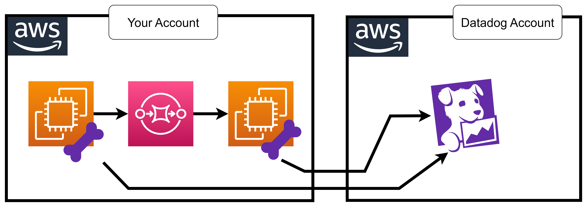

# 47 ⚡ Hands-on DSM Python SQS



## create SQS

## app producer

deps
```
pip3 install boto3 ddtrace
```

envs
```bash
export DD_DATA_STREAMS_ENABLED=true
export DD_ENV=dev
export DD_SERVICE=producer-app
```

producer.py
```python
import boto3
import time
import sys
from ddtrace import tracer

sqs = boto3.client('sqs', region_name='us-east-1')

queue_url = ""

while True:
      with tracer.trace(
              name="sqs.send_message",
              service=f"producer-app",
          ) as span:
          rs = sqs.send_message(
              QueueUrl=queue_url,
              MessageBody="test",
          )
          print("send ok")
          print(rs)
      time.sleep(1)
```


## app consumer

envs
```bash
export DD_DATA_STREAMS_ENABLED=true
export DD_ENV=dev
export DD_SERVICE=producer-app
```

consumer.py
```python
import boto3
import time
import sys
from ddtrace import tracer

sqs = boto3.client('sqs', region_name='us-east-1')

queue_url = ""

while True:
      with tracer.trace(
              name="sqs.receive_message",
              service=f"consumer-app",
          ) as span:
          rs = sqs.receive_message(
              QueueUrl=queue_url,
              MessageBody="test",
          )
          if not 'Messages' in rs:
              time.sleep(1)
              continue
          for msg in rs['Messages']:
              print(msg)
              receipt = msg['ReceiptHandle']
              sqs.delete_message(
                  QueueUrl=queue_url,
                  ReceiptHandle=receipt,
              )
          print("receive ok")
          print(rs)
```