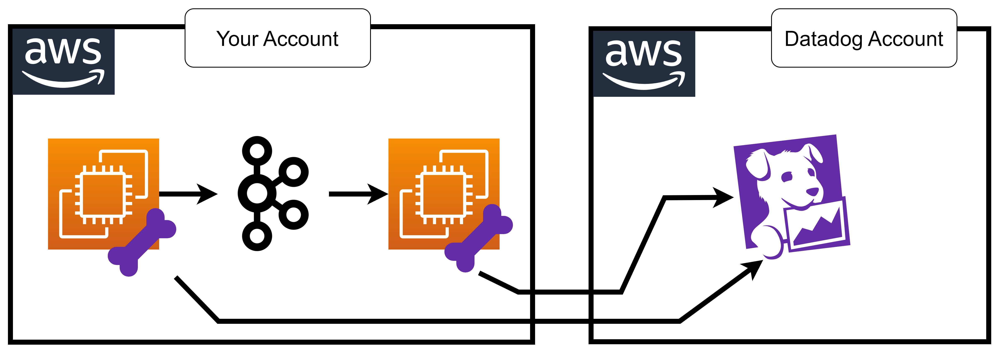

# 48 ⚡ Hands-on DSM Python Kafka



https://docs.datadoghq.com/data_streams/

## 3 EC2 instances

## start kafka container

```bash
mkdir data
chmod -R 777 data
```

https://dev.to/deeshath/apache-kafka-kraft-mode-setup-5nj

```bash
name: 'stream'
version: '3.8'
services:
  kafka:
    image: confluentinc/cp-kafka:latest
    hostname: kafka
    container_name: kafka
    ports:
      - "9092:9092"
      - "9093:9093"
    environment:
      KAFKA_KRAFT_MODE: "true"  # This enables KRaft mode in Kafka.
      KAFKA_PROCESS_ROLES: controller,broker  # Kafka acts as both broker and controller.
      KAFKA_NODE_ID: 1  # A unique ID for this Kafka instance.
      KAFKA_CONTROLLER_QUORUM_VOTERS: "1@localhost:9093"  # Defines the controller voters.
      KAFKA_LISTENERS: PLAINTEXT://0.0.0.0:9092,CONTROLLER://0.0.0.0:9093
      KAFKA_LISTENER_SECURITY_PROTOCOL_MAP: PLAINTEXT:PLAINTEXT,CONTROLLER:PLAINTEXT
      KAFKA_INTER_BROKER_LISTENER_NAME: PLAINTEXT
      KAFKA_CONTROLLER_LISTENER_NAMES: CONTROLLER
      KAFKA_ADVERTISED_LISTENERS: PLAINTEXT://localhost:9092
      KAFKA_LOG_DIRS: /var/lib/kafka/data  # Where Kafka stores its logs.
      KAFKA_AUTO_CREATE_TOPICS_ENABLE: "true"  # Kafka will automatically create topics if needed.
      KAFKA_OFFSETS_TOPIC_REPLICATION_FACTOR: 1  # Since we’re running one broker, one replica is enough.
      KAFKA_LOG_RETENTION_HOURS: 168  # Keep logs for 7 days.
      KAFKA_GROUP_INITIAL_REBALANCE_DELAY_MS: 0  # No delay for consumer rebalancing.
      CLUSTER_ID: "Mk3OEYBSD34fcwNTJENDM2Qk"  # A unique ID for the Kafka cluster.
    volumes:
      - /var/run/docker.sock:/var/run/docker.sock
      - ./data:/var/lib/kafka/data  # Store Kafka logs on your local machine.
```

## producer app

deps
```bash
pip3 install ddtrace requests confluent-kafka
```

envs
```
export DD_DATA_STREAMS_ENABLED=true
export DD_ENV=dev
export DD_SERVICE=kafka-producer-app
```

```python
import random
import sys
import time
from ddtrace import tracer
import requests
from confluent_kafka import Producer
import os

host = ""

p = Producer({'bootstrap.servers': f'{host}:9092'})

while True:
    topic = f"mytopic"

    p.produce(topic, "asdfasdf".encode('utf-8'))
    print("ok")
    p.flush()
    print("flush")
    time.sleep(1)
```


## consumer app

envs
```
export DD_DATA_STREAMS_ENABLED=true
export DD_ENV=dev
export DD_SERVICE=kafka-consumer-app
```

```python
import random
import sys
import time
from ddtrace import tracer
import requests
from confluent_kafka import Consumer
import os

host = ""

topic = f"mytopic"

c = Consumer({
    'bootstrap.servers': f'{host}:9092',
    'group.id': f'mygroup',
    'auto.offset.reset': 'earliest'
})

c.subscribe([topic])

while True:
    msg = c.poll(1.0)

    if msg is None:
        continue
    if msg.error():
        print("Consumer error: {}".format(msg.error()))
        continue

    print('Received message: {}'.format(msg.value().decode('utf-8')))

c.close()
```


