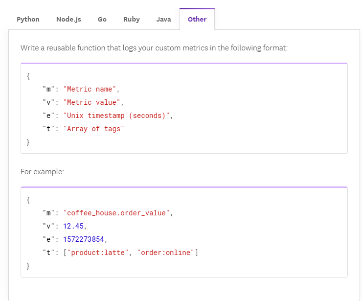

# 55 ⚡ Hands-on Send custom metrics via Log DD Lambda Forwarder


https://docs.datadoghq.com/serverless/aws_lambda/metrics/?tab=other#submit-historical-metrics-with-the-datadog-forwarder



```json
{
    "m": "coffee_house.order_value",
    "v": 12.45,
    "e": 1572273854,
    "t": ["product:latte", "order:online"]
}
```