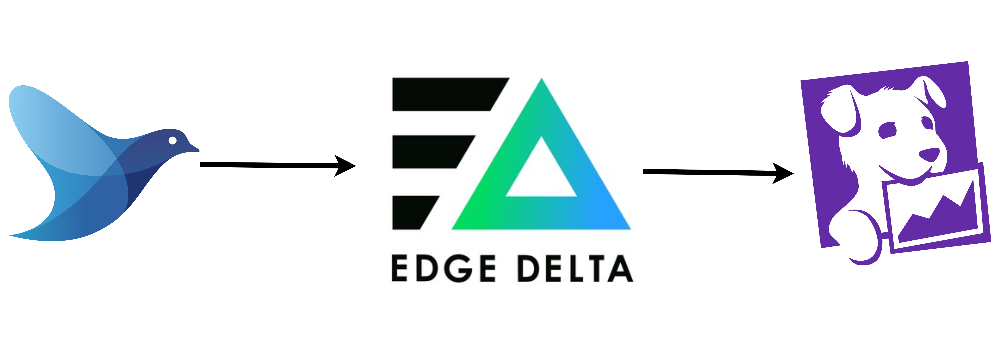

# 60 ⚡ Hands-on Sampling Logs using Edge Delta




https://docs.fluentbit.io/manual/2.0/pipeline/outputs/forward

```
docker run -u 0 --rm -it public.ecr.aws/docker/library/fluentd:latest sh
```

```
<source>
  @type dummy
  tag dummy.log
  dummy {"message": "error occurred", "level": "error"}
  rate 30
</source>

<source>
  @type dummy
  tag dummy.log
  dummy {"message": "info occurred", "level": "info"}
  rate 30
</source>

<source>
  @type dummy
  tag dummy.log
  dummy {"message": "debug occurred", "level": "debug"}
  rate 30
</source>

<match dummy.**>
  @type forward
  heartbeat_interval 1s
  
  <server>
    host my_host
    port my_port
  </server>
</match>
```