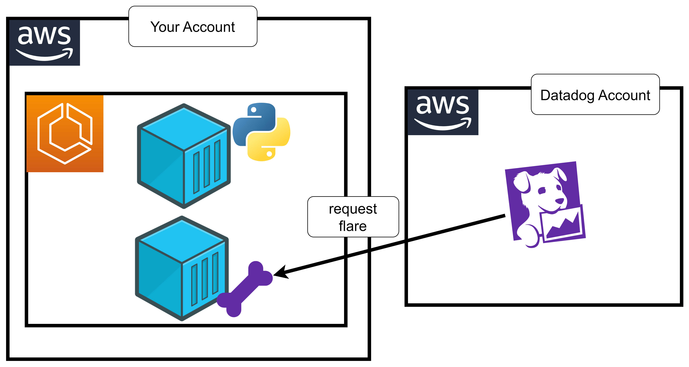

# 62 ⚡ Hands-on Sending a flare from ECS Fargate




## simple flask application

```python
from flask import Flask
import logging

# Basic configuration
logging.basicConfig(level=logging.INFO)

app = Flask(__name__)

@app.route('/')
def hello_world():
    logging.info("request received") 
    return 'Hello, World!'

if __name__ == '__main__':
    app.run(host='0.0.0.0', port=5000, debug=True)
```

dockerfile

```
FROM public.ecr.aws/docker/library/python:3.12

COPY ./app.py /app.py

RUN pip3 install flask flask-cors

CMD ["python3", "/app.py"]
```

```bash
export accid="654654299310"
export img="flaskflare"
```

login
```bash
aws ecr get-login-password --region us-east-1 | docker login -u AWS --password-stdin $accid.dkr.ecr.us-east-1.amazonaws.com
```

create ecr
```
aws ecr create-repository --repository-name $img
```

build push
```bash
docker build -t $img .
docker tag $img $accid.dkr.ecr.us-east-1.amazonaws.com/$img:latest
docker push $accid.dkr.ecr.us-east-1.amazonaws.com/$img:latest
```

## datadog-agent


### datadog-agent

https://docs.datadoghq.com/integrations/aws-fargate/?tab=webui

* image: `public.ecr.aws/datadog/agent:latest`
* envs
  * `DD_API_KEY`
  * `ECS_FARGATE`: `true`
  * `DD_APM_ENABLED`: `true`
  * `DD_SITE`: `datadoghq.com`
  * `DD_HOSTNAME`: `ecsfargatetask`
  * `DD_TAGS`: `env:dev service:myflask`
  
```
{ "name": "DD_API_KEY", "value": "myapikey" },
{ "name": "ECS_FARGATE", "value": "true" },
{ "name": "DD_APM_ENABLED", "value": "true" },
{ "name": "DD_SITE", "value": "datadoghq.com" },
{ "name": "DD_HOSTNAME", "value": "ecsfargatetask" },
{ "name": "DD_TAGS", "value": "env:dev service:myflask" }
```


## requesting flare